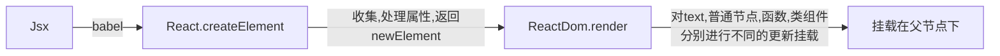

### 谈谈对React的理解

React是一个网页UI库，通过组件化的方式解决视图层开发复用的问题，本质是一个组件化框架

**核心设计思想**

> **声明式** ：优势在于直观与组合
>
> **组件化** ：优势在于视图的拆分与模块复用，容易做到低耦合和高内聚
>
> **通用性** ： 优势在于一次学习随处编写，比如React Natvie ,React 360 ,主要靠虚拟Dom来保证实现，使得React的使用范围变得足够广，无论是Web，Native ，VR，甚至是Shell应用都可以进行开发

**劣势**

> 没有提供一揽子解决方案，在开发大型项目中需要在社区寻找解决方案，虽然一定程度上**促进了社区的发展**，但也为开发者**在技术选型和学习适用上造成了一定成本**

### 为什么React要使用JSX

**一句话解释JSX**

> JSX是一个Javascript的语法拓展，也可以说是一个**类似于XML的ECMAscript的语法拓展**
>
> 它本身没有太多的语法定义，也不希望引入更多的标准

**核心概念**

>- React本身并不强制使用JSX
>
>- JSX本身是React.createElement的语法糖，
>
>- React需要将组件转化为虚拟DOM数，XML在树结构的描述上天生具有可读性强的优势
>
>- JSX会使代码变得简洁清晰
>
>- babel将Jsx会还原成React.createElement

**方案对比**

> **模板** ：引入了过多新的概念和语法
>
> **模板字符串** ：代码结构变得复杂，代码提示困难
>
> **JXSON** : 没有很好的语法提示

**Babel如何将JSX转化为JS的**

```javascript
module.exports = function(babel){
    var t = babel.type
    return{
        name:"custom-jsx-plugin",
        visitor:{
        JSXElement(path){
            var openingElement = path.node.openingElement
            var tagName = openingElement.name.name
            var args = []
            args.push(t.stringLiteral(tagName))
            var attribs = t.nullLiteral()
            args.push(attribs)
            var reactIdentifer = t.identifer("React")
            var createElementIdentifer = t.identifer("createElement")
            var callee = t.memberExpression(reactIdentifer,createElementIdentifer)
            var callExpression = t.callExpression(callee,args)
            callExpression.arguments = 				callExpression.arguments.concat(path.node.children)
			path.replaceWith(callExpression,path.node)
        }
    }
    }
}
```

### React组件生命周期

**概念**

*挂载阶段*

>1. constructor ：常用于初始化 （社区不推荐这么写） 直接顶层 初始化state
>
>2. getDerviedStateFromProps : 在props变化时候更新state
>
>3. UNSAFE_componentWillMount: 用于组件将要加载前做一些操作，但已经被标记为弃用，因为在React的异步渲染机制下，该方法可能会被多次调用
>
>4. render ：返回JSX结构，用于描述具体的渲染内容
>
>5. componentDidMount：用于组件加载完成时候做某些事情

*更新阶段*

> 1. UNSAFE_componentWillReceiveProps
>
> 2. getDerviedStateFromProps
>
> 3. shouldComponentUpdate : 进行浅比较判断是否进行更新
>
> 4. UNSAFE_componentWillUpdate
>
> 5. render
>
> 6. getSnapshotBeforeUpdate ：返回值作为componentDidUpdate第三个参数使用
>
> 7. componentDidUpdate ：更新完成

*卸载阶段*

>componentWillUnmount：用于清理工作，比如说定时器

**其他**

> - 函数组件没有生命周期，任何时候都会进行重新渲染，但官方提供React.memo来跳过渲染
> - PureComponent默认实现了shouldComponentUpdate，仅在props和state进行浅比较后，确认变更后才会触发重新渲染
> - 错误边界：`getDerivedStateFromError`,`componentDidCatch`,**渲染**时的报错只能通过componentDidCatch捕获

**进阶提问**

*React的请求应该放在哪里*

> - 对于异步请求，应该放在componentDidMount里面
> - 从时间顺序来看，除componentDidMount还可以有constructor和componentWillMount，一个很少用，一个已经被标记为废弃并且易引发bug，不利于代码维护
> - 最好放在componentDidmount

### 类组件和函数组件的区别

**共同点**

> 实际用途一样，无论是高阶组件还是异步加载组件，都可以作为基础展示UI

**不同点**

*基础认知*

> - 本质代表了两种不同的设计思想和心智模式
>
> - 类组件的根基是OOP，面向对象的编程
> - 函数组件的根基是FP，也就是函数式编程
> - 相较于类组件，函数组件更**纯粹，简单，易测试**

*使用场景*

> - 在不使用Recompose或者hooks的情况下，如需使用生命周期，就用`类组件`,限定场景是固定的
> - 在hooks的加持下，类组件和函数组件的边界就变得模糊了，
> - 在需要继承的情况下用类组件，但是目前来说组合优于继承，所以，这方面优势也在淡出

*性能优化*

> - 类组件通过`shouldComponentUpdate`函数来阻断渲染
> - 函数组件通过`React.memo`来优化

*未来趋势*

> - 函数组件成为未来的主推方案
> - 因为类组件this的模糊性，业务逻辑散落在生命周期中，代码缺乏标准的拆分模式
> - hooks提供比原先更细腻的逻辑拆分和复用，适合时间切片和并发模式

### 如何设计React组件

**设计分类**

*展示组件*

> **概念**
>
> - 只做展示，不额外增加功能的组件
> - 受制于外部的`props`
> - 具有极强的**通用性**，**复用性**
>
> **分类**
>
> - **代理组件**:用于封装常用属性减少代码重复
>
> - **样式组件**:把样式内聚在自己的内部
> - **布局组件**:把布局内聚在自己的内部

*灵巧组件*

> **概念**
>
> - 处理业务逻辑和数据状态
> - 面向业务，功能更丰富，复杂性更高，复用度更低
>
> **分类**
>
> - **容器组件**:把**网络请求**和**逻辑处理**放在容器组件中处理
>
> - **高阶组件**:逻辑复用的高阶手段
>
>   > **使用场景**
>   >
>   > - 检查登录态
>   >
>   > - 封装埋点
>   > - 可以基于装饰器进行链式调用
>   > - 渲染元素的劫持，比如loading状态的展示
>
>   > **缺陷**
>   >
>   > - 无法获取静态方法，可以通过复制调用，社区也有解决方案
>   > - refs无法透传，但可以通过React.forwardRefs来解决

**进阶**

如何在渲染劫持中为原本的渲染结果添加新的样式？

```javascript
const withLoading = (WrappedComponent)=>{
    return class extends WrappedComponent{
        render(){
            if(this.props.isLoading){
                return <Loading/>
            }else{
				return super.render()
            }
        }
    }
}
```

### setState是同步更新还是异步更新的

**setState概念**

> 用于变更状态，触发组件重新渲染，更新视图UI
>
> setState并非是真异步而是看上去像异步，通过`isBatchingUpdates`判断是否塞进更新队列还是直接更新，true为异步操作，false为直接更新

**何时`isBatchingUpdate`为true？**

> 在React可以控制的范围为true，比如**React生命周期事件**和**合并事件**
>
> 在**原生事件**比如`setTimeout` `addEventListener` `setInterval`为**同步更新**

**为什么setState不改为同步更新**

> 保持内部的一致性，`props`的更新不是同步
>
> 启用并发更新，完成异步渲染

### React如何面向组件跨层级通信

**分类**

> - 父子组件通信
> - 兄弟组件通信
> - 跨层级通信

**实现**

*父子组件通信*

> **父->子**
>
> ```javascript
> 1.在函数式组件外导入 import { useState } from 'react'
> 2.在函数式组件类  const [num, setNum] = useState(0) 这样我们就给num赋予了初始值
> 3.在子组件标签上定义 <Son num={num}></Son>
> 4.在子组件内部的函数式参数上写上实参props
> 5.直接调用 props.num
> ```
>
> **子->父**
>
> 依赖回调函数

*兄弟组件通信*

> 将共享状态提升到最近的公共父组件中，由公共父组件管理这个状态

*跨层级组件通信*

> **Context**
>
> - 导入并调用`createContext`方法，得到``Context``对象，导出对象
> - 使用 ``Provider``组件包裹根组件，并通过 ``value`` 属性提供要共享的数据
> - 在任意后代组件中，如果希望获取公共数据： 导入``useContext``；调用`useContext`(第一步中导出的`context`) 得到`value`的值
>
> **全局事件和全局变量**
>
> 不推荐,简单用于存储临时的事件与变量
>
> **状态管理框架**
>
> `Flux`  `Redux`  `Mobx`

### 列举一种你常用的状态管理框架

**Flux**:提出了MVC以外的成功实践：**单向数据流**

**Redux**

*三原则*

>- 单一数据源**Store**：整个应用的state被储存在一个object tree中，并且这个object tree只存在唯一一个Store中
>- 纯函数**Reudcer**：为了描述Action如何改变状态树，编写一个纯函数的Reducer
>- **state**是只读的：唯一个可改变state的方法是触发action，Action是用于描述已发生事件的普遍对象

*如何解决**副作用**？*

> **副作用概念**
>
> 任何具备业务价值的Web应用必要执行复杂逻辑如AJAX请求等异步工作，这类逻辑使函数在每次执行过程中产生不同的变化，这样与外界交互叫做**副作用**
>
> **Redux是怎么解决副作用的?**
>
> 在**Dispatch**时有middleware中间层拦截分发的**Action**添加额外行为，可添加副作用
>
> 允许**Reducer**层直接处理副作用
>
> 一类方案：Redux-thunk 作用： 处理异步Action
>
> ```javascript
> const createThunkMiddleware = (extraArgument)=>{
>  return ({dispatch,getState})=>(next)=>(Action)=>{
>      if(typeof Action === 'function'){
>          return Action(dispatch,getState,extraArgument)
>      }
>      return next(Action)
>  }
> }
> const thunk = createThunkMiddleware()
> thunk.withExtraArgument = createThunkMiddleware
>
> export default thunk
> ```
>
> `Redux-promise` `Redux-saga` `Redux-observable`
>
> 社区方案
>
> `Rematch` `dva`

*优点*

> - 结果可预测
> - 代码结构严格，易于维护
> - 模块分离清晰，异步编写单元测试
> - 定位问题简单快捷
> - 单一数据源使服务端同构变得简单快捷
> - 社区生态好，各问题的解决方案多

*实现redux*

> createStore
> 即通过createStore，注入Reducer与middleware，生成Store
> Store对象的getState，subscrible与dispatch
> getState获取当前状态树，subscribe函数订阅状态树变更，dispatch发送action

**Mobx**

*Mobx的监听方式*

> 在Mobx5之前，采用`Object.defineProperty`
>
> 在Mobx5之后，采用`Proxy`方案类似于`Vue`

*优点*

> - 样板代码少
> - 简单上手快
> - 响应式更新数据让开发人员心智负担小

### VirtualDom的工作原理是什么？

**什么是虚拟Dom**

> 虚拟Dom是对真实Dom的一层抽象，以`javascript`**Vnode**节点作为基础的树，用于描述真实节点，最终可以通过一系列手段映射给真实Dom，

**为什么我们需要虚拟Dom**

>  操作Dom的代价是昂贵的，哪怕是一个div都包含了巨量的属性，频繁操作会导致页面卡顿

**React如何将虚拟Dom转变真实Dom**



##### 虚拟Dom的优势在哪里

> - 降低了代码风险
>
> - 跨平台的成本低 ,通过对虚拟Dom的结构描述对象实现多端转换

 ##### 缺点

> - 内存占用高
> - 无法进行机制优化

**其他应用场景**:用于埋点统计和数据记录

### 与其他框架相比，React 的 diff 算法有何不同？

**概念**

> 1. 真实Dom首先会映射为**虚拟Dom**
>
> 2. 当虚拟Dom变化后会根据差距生成patch,**patch是结构化的数据**,包含增加,更新,移除等
> 3. **根据patch去更新真实Dom**,反馈到用户界面上

**更新时机**

> - state变化
>
> - hooks调用之后

**优化策略**

> - Fiber机制下节点和树分别采用**FiberNode**和**FiberTree**进行重构
> - Fiber机制下整个更新过程由**current**与**workInProgress**两株树**双缓冲**完成

**其他框架**

*Preact*

> 没有patch的过程,直接进行属性更新

*Vue2.0*

> Vue2.0使用了`snabbdom`,整体思路和React相同,但在元素对比上,如果新旧两元素是同一元素,且没有设置key时,snabbdom在Diff子元素中会一次性对比旧节点,新节点及他们首尾四个节点,以及验证列表是否有变化

**如何优化代码**

> - 避免跨层级节点移动
>
> - 设置唯一key
>
> - 尽量减少组件层级深度,因为过深的层级会加深遍历深度,带来性能问题
>
> - 设置shouldComponentUpdate或者React.pureComponent减少Diff次数

### 解释React渲染流程

**React如何将虚拟Dom转变真实Dom**


**概念**

> React的渲染过程大致一致,但具体协调不同,以react16为分界线分为**StackReconciler**和**FiberReconsiler**,这里的协调从狭义上来讲特制react的diff算法,广义上来讲是react的**reconsiler**模块,通常包含了**diff算法和一些公共逻辑**

**stackreconciler**

> 它的核心调度算法是递归,调度的基本单位是事务,这里的事务是react团队从后端提取到的概念,
>
> 是通过ReactMount模块完成,更新通过ReactUpdate完成,模块之间相互分离,落脚的执行点也是事务,

**fiberreconciler**

*特点*

> **协作式多任务模式**:在这个模式下,线程会**定时放弃自己的运行权利**交还给主线程,
>
> **策略优先级模式**:通过**标记tag**的方式分优先级执行,比如动画等标记为high的任务会优先执行,

*概念*

> **基本单位**: fiber
>
> **fiber**:通过**reactElement**进行二次封装,提供了**指向父子兄弟节点的引用**,给diff的双向链表提供了实现基础

*生命周期*

> **render阶段**
>
> **特点**:可中断,可停止,无副作用
>
> **构建**:通过构建**workInProgress树**计算出diff,以**current树为基础**,每个**fiber为基础单位**,自下而上的逐个**检查和构造workInprogress树**,这个过程是**基于递归**而不是循环来完成
>
> **执行**:通过**request**和**callback**来执行每组任务,**每组的每个任务被称为work**,每个work完成后会**检查是否有优先级更高的work需要插入**,如果有就插入,如果没有就继续执行**,优先级通常是动画或者标记为high的会先进行处理**,每完成一组后会**把调度权交还给主线程**,直到下次request和callback调用,继续构建workInprogress树,

> **commit阶段**
>
> **特点**:不可暂停
>
> **处理Effects列表**:根据Effects列表**更新Dom树**,**回调生命周期**,**响应reference**等,但要注意这个阶段是**同步执行**的不可暂停,所以不要在**componentWillUnmount**,**componentDidmount**,**componentDidUpdate**中执行重度消耗算力的任务

**总结**

> 日常任务重两种渲染流程差别不大,但在**动画之类占用主线程的情况中**,stackReconsiler会卡顿,而fiberReconsiler会带来高性能的表现

**拓展**

为什么Stack Reconsiler 模式下 render函数不支持return*数组呢*

>  递归只能返回一个节点,不支持数组

### React渲染异常会造成什么结果

**是什么**

*现象* : dev模式化会报错,pro下会白屏

*原理*

> 组件内的**javascript错误**会导致**React内部状态被破坏**并**在下一次渲染中产生无法追踪的错误**,这些错误基本上是由较早的其他代码,(**非React组件代码**)错误引起的,但React没有提供一种在组件内优雅的处理这些错误的方式,也**无法从错误中恢复**

*会出现在哪*

> 一般是在渲染层进下数据转换的过程中出现错误,而前端的渲染数据一般是通过后端来进行获取,数据是否安全就成了至关重要的问题

*如何解决*

> - 可选链操纵符
> - typescript支持
> - 通过高阶组件拦截报错信息

**怎么解决**

*工程化*

> **预防层面**:需看**空安全方案在项目中的覆盖量**从而保证团队内项目都将空安全用了起来
>
> **兜底层面**:需保障方案在项目中的覆盖量,**统计兜底页面成功兜底次数**,最后兜底页面展示时即时完成线上报警
>
> **覆盖量怎么检测**:通过查看项目的package.json文件是否引入相关的库,排查方案因不同的公司而异

### 如何分析和调优性能瓶颈

**衡量**

> - Lighthouse
> - 阿里云的ARMS
> - New Relic

*采集过程*:以阿里云的ARMS为例,采集通常是由一个**JavaScriptSDK**来完成的

*指标*

> **FCP**:首次绘制内容的耗时
>
> **TTI**:页面可交互的时间
>
> **PageLoad**:页面完全加载的时间
>
> **FPS**:前端页面帧率
>
> **静态资源及API请求成功率**

**排查**

*FCP首次绘制内容的耗时*

> - Loading图标
> - 骨架屏
> - SSR服务端渲染

*TTI页面可交互的时间*

> - 核心内容同步加载
> - 非核心内容异步加载
> - 图片懒加载

*PageLoad 页面完全加载的时间*

> 异步加载

*FPS 前端页面帧率*

> - reactwindow
> - 渲染优化

*静态资源及API请求成功率*

> - 静态资源能用CDN就用CDN,大幅提高静态资源加载的成功率
> - 域名解析时报可以采用静态资源域名自动切换的方案
> - HTTPS

**收益**

> 通过TP数 TP50,TP90来具体量化技术转化效果

### 如何避免重新渲染

**优化时机**

*重新渲染时会发生什么*

> React会构建并维护一套内部的虚拟Dom树,因操作Dom相对操作Javascript对象更慢
>
> 所以根据虚拟Dom树生成的差异更新真实Dom,每当一个组件的props或者state发生变更时,React都会将最新的元素与之前渲染的元素进行对比,以此决定是否有必要更新真实Dom,当它们不同时,React会更新该Dom
>
> 重新渲染成本昂贵,如果一次性引发**重新渲染层级足够深会阻塞UI主线程执行**,造成卡顿,引起页面帧率下降
>
> **根据业务要求进行优化**

**定位方式**

> 1. 还原场景,定位问题
>
> 2. 通过工具进行复现
>
>    - 通过Chrome自带的Performance分析,主要用于**查询javaScript执行栈中的耗时**,**确认函数卡顿点**
>
>    - 通过ReactDeveloperTools的Profiler**分析组件的渲染次数**,**开始时间和耗时**

**处理方案**

> **缓存**:reselect
>
> **不可变数据**:ImmutableJs immersejs
>
> **手动控制**:shouldComponentUpdate useMemo React.memo

### 如何提高React代码的可维护性

**可分析性**

*目的*:快速**定位线上问题**

预防

> 人工审查核心逻辑代码
>
> 工具审查
>
> - ESLint

*兜底*

> **理想**:改造编译流水线,在发布过程上传SourceMap到报错收集平台
>
> **实际**:Mozilla的开源工具sourcemap,恢复对应源代码信息

**可改变性**

*目标*:代码易于**拓展**,业务易于**迭代**

*方案*

> **划分边界和模块隔离**
>
> **组件设计模式**:分离组件
>
> **状态管理框架**:Redux边界清晰容易拆分

**稳定性**

*目标*:避免不必要的线上问题

*方案*

> **测试**:前端单元测试主要有**Chai**,**Mocha**和**Jest**其中Jest与React生态最为紧密,由FaceBook主推**一般选取业务核心逻辑**编写测试是更有利于整体项目的稳定性

**易测试性**

*目标*:易于**发现代码的潜在问题**,合理的架构划分使得**模块之间互不干涉**,各自分离可以使测试相对独立

*方案*

> **纯函数**在测试上有着得天独厚的优势,让测试验证过程变得更为简单,现在前端的一种思潮就是编写一个接一个的函数而比较少写类

**可维护性的依从性**

*目标*:提升代码的可阅读性

*方案*

> **统一编码规范和代码风格**
>
> **ESLint**:针对JavaScript
>
> **StyleLint**:针对样式
>
> **CommitLint**:针对代码提交
>
> **Pretter**:针对代码风格
>
> **EditorConfig**:针对编辑器风格的

###  React Hook 的使用限制有哪些？

**设计初衷**:改进React组件的开发模式

**使用限制**

> 不要在循环,条件或嵌套中调用Hook
>
> 在React的函数组件中调用hook

**问题领域**

*组件之间难以复用状态逻辑*

> - 高阶组件
> - render props
> - 状态管理框架

*复杂的组件变得难以理解*

> - 生命周期函数和业务逻辑耦合
> - 组件关联部分难以拆分

*人和机器都容易混淆类*

> - this
> - - 值捕获问题 -> 类熟悉草案
>
> - 难以编译优化

**方案原理**:[not magic,just arrays](https://medium.com/@ryardley/react-hooks-not-magic-just-arrays-cd4f1857236e)

**如何规避**:在ESlint中引入**eslint-plugin-react-hooks**完成自动化检查就行

### useEffect和useLayoutEffect区别

**共同点**

*使用方式*

> `useEffect`和`useLayoutEffect`*函数签名*相同
>
> 源码调用同一个函数`mountEffectImpl`
>
> `useEffect`先调用`mountEffect`再调用`mountEffectImpl`
>
> `useLayoutEffect`先调用`mountLayoutEffect`再调用`mountEffectImpl`
>
> 一定程度上可以相互替代

*运用效果*

`useEffect`和`useLayoutEffect`两者都是用于处理副作用的,这些副作用包括改变Dom,设置订阅,操作定时器等

**不同点**

*使用场景*

>  大多数场景使用`useEffect`,但代码引起页面闪烁的时候推荐使用`useLayoutEffect`
>
>  如果有直接操作DOM样式或者引起DOM样式更新的场景推荐使用`useLayoutEffect`

*独有能力*

> useEffect异步处理副作用
>
> useLayoutEffect同步处理副作用

**设计原理**

> hooks列表中EffectHooks会有些不同,它涉及了一些额外的处理逻辑,每个FIber的Hooks队列中保存了Effect节点
>
> 每个Effect的类型都有可能不同,需要在合适的阶段去执行
>
> `useEffect`: **HookPassive**
>
> `useLayoutEffect` : **HookLayout**
>
> 标记为HookLayout的Effect会在所有DOM变更的时候同步调用,所以可以使它来读取DOM布局并同步触发重渲染
>
> 计算量较大的耗时任务必然会造成阻塞,所依要根据实际情况酌情考虑使用

**未来趋势**:根据场景酌情选择

### 谈谈ReactHooks的设计模式

**认知基础**

> 忘记生命周期,以Effects的方式开始思考
>
> 以事务的角度来思考问问题并编写代码
>
> 经过Hooks的改造,只需要一个Effect就完整实现了多个生命周期函数才能完成的业务逻辑,比如监听和取消监听
>
> 如果希望进一步的抽象和复用,只需要将Effect的代码抽象定义为自定义Hook,这比生命周期来的简单

**常规操作**

> **React.memo VS React.useMemo**
>
> - hooks推荐使用useMemo,可以实现更加精细化的操作
>
> **常量**
>
> - 由于函数组件每次重新渲染的时候都会重新执行,所以常量应该放置到函数外面去避免每次都重新创建,而如果定义的常量是一个函数,且需要使用函数组件内部的变量做计算,那么一定要使用useCallback来缓存函数
>
> **useEffect第二个参数**
>
> - 在设计上他同样是进行浅比较,如果传入的是引用类型,那么很容易被判定为不相等,所以尽量不要使用引用类型作为判断条件,容易出错

**工程实践**

 *外观模式*:在组件中通过各个自定义Hook去操作业务逻辑,每个自定义Hook都是一个独立的子模块有属于自己的**领域模型**

### React-Router 的实现原理及工作方式分别是什么？

**实现原理**

*外部:基础原理*

> 切换Hash运用了浏览器Hash,
>
> 切换网址运用了HTML5 HistoryApi中的pushState和replaceState
>
> 服务端要完成HistoryApiFallback的配置

*内部:实践方案*

> react-router
>
> **react-router-dom**:基础路由是BrowserHistory,调用histotryApi
>
> **react-router-native**:基础路由是MemoryHistory

**工作方式**

*整体:设计模式*

> 运用了Monorepo架构一个packages包括多个package
>
> 运用了ContextApi完成了数据共享

*局部:工作方式*

> 1. Context容器,分别是Router与MemoryRouter,主要提供上下文消费容器
> 2. 直接消费者提供路由匹配功能分别是Route,Redirect Switch
> 3. 与平台关联的功能组件分别是react-router-dom中的LinkNavLink及react-native中的DeepLinking

### React 中你常用的工具库有哪些？

**初始化**

> 运用react-app-rewired对create-react-app提供拓展能力
>
> 单个组件项目使用create-react-library
>
> 大型组价项目推荐使用storyLibrary

**开发**

*路由*:ReactRouter

*样式*:tailwindicss styledcomponent windicss unocss

*展示组件*:Antd

*功能组件*:React-draggable实现拖拽 Video-React用于播放视频 react-pdf-viewer用于预览PDF react-window和react-virtualized用于长列表问题的解决

*构建*:webpack vite

*检查*:ESLint代码规范检查,代码编写测试 jest react-testing-library react-hooks-testing-library

*发布* : s3-plugin-webpack处理静态资源上传

### React反向代理

```javascript
npm install http-proxy-middleware

const {createProxyMiddleware} = require("http-proxy-middleware")
module.exports =(app)=>{
    //  /api是代理路径
    app.use(createProxyMiddleware('/api',{
        target:"https://localhost:8080",
        changeOrigin:true,
        pathWrite:{
            '^/api':''
        }
    }))
}
```

### 如何阻止组件渲染

**类组件**

> shouldComponentUpdate return false
>
> 继承React.PureComponent,只要props未改变,就不会执行render

**函数组件**

> 使用React.memo包裹组件函数,props没改变就不会执行函数
>
> 使用React.memo包裹组件函数,returnTRUE就不会执行

### useMemo和useCallBack的区别

**概念**:useMemo和useCallback都是reactHook提供的两个API，用于缓存数据，优化性能；两者接收的参数都是一样的，第一个参数表示一个回调函数，第二个表示依赖的数据。

**共同作用**
在依赖数据发生变化的时候，才会调用传进去的回调函数去重新计算结果，起到一个缓存的作用

**两者的区别**

> **useMemo** : 缓存的结果是回调函数中return回来的值，主要用于**缓存计算结果的值，应用场景如需要计算的状态**
>
> **useCallback** : 缓存的结果是函数，主要用于缓存函数，应用场景如需要缓存的函数，因为函数式组件每次任何一个state发生变化，会触发整个组件更新，一些函数是没有必要更新的，此时就应该缓存起来**，提高性能，减少对资源的浪费**；另外还需要注意的是，**useCallback应该和React.memo配套使用**，缺了一个都可能导致性能不升反而下降。

